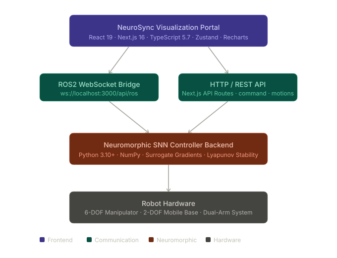

# NeuroSync Robotics Platform

> Real-time neuromorphic robot control and monitoring platform with spiking neural networks and ROS2 integration

[](https://creativecommons.org/licenses/by-nc/4.0/)
[](https://nextjs.org/)
[](https://react.dev/)
[](https://www.typescriptlang.org/)
[](https://tailwindcss.com/)
[]()

---

## Overview

NeuroSync is an interactive real-time visualization and control portal for neuromorphic robot systems powered by spiking neural networks (SNNs). It bridges the gap between neuroscientific research and practical robotics, providing engineers and researchers with an intuitive interface to monitor, control, and analyze robot behavior driven by biologically-inspired neural controllers.

---

## Screenshots

**Landing Page**


*Hero section - Real-Time Control, SNN-Powered, and Safety First feature highlights.*

<br/>


*Project metadata: author, CC-BY-NC-4.0 license, and GitHub repository link.*

<br/>

**Robot Fleet Dashboard**


*Fleet overview showing Manipulator Alpha, Mobile Base Beta, and Dual-Arm Gamma with live battery, temperature, CPU, and signal metrics. 95% connection quality across the fleet.*

<br/>

**Manipulator Alpha - Command Console**


*Per-robot control panel for the 6-DOF collaborative manipulator. ROS2 Command Console accepts raw JSON payloads. Emergency Stop always present in the header.*

---

## Key Features

| Feature | Description |
|---|---|
| Real-Time Monitoring | Live telemetry from multiple robots with sub-500ms latency updates |
| Joint-Level Control | Precise 6-DOF joint control with position feedback visualization |
| Command Console | Advanced ROS2 command interface accepting raw JSON payloads |
| Motion Library | Predefined motion sequences executable with a single interaction |
| Fleet Management | Monitor and command multiple robots from a unified dashboard |
| Neuromorphic Integration | SNN controller backends with Lyapunov-stable surrogate gradient training |
| Safety Architecture | Emergency stop, connection health monitoring, and failsafe controls |
| Responsive Design | Fully functional across desktop, tablet, and mobile viewports |

---

## Architecture



---

## Installation

### Prerequisites

- Node.js 18+ and pnpm
- Python 3.10+
- ROS2 Humble or later *(optional, for real hardware)*
- Git

### Frontend

```bash
git clone https://github.com/Nihara-D/neuromorphic-snn-controller-research-env.git
cd neuromorphic-snn-controller-research-env
pnpm install
pnpm dev
# → http://localhost:3000
```

### Neuromorphic Backend

```bash
uv sync
uv run python scripts/spike_encoder.py
uv run python scripts/snn_surrogate_gradient.py
uv run python scripts/lyapunov_stability.py
```

---

## Usage

Navigate to `http://localhost:3000/dashboard` to view all connected robots, system health metrics, and connection status. Click any robot to access its individual control panel.

**Joint control example:**
```typescript
Joint "manipulator_joint_1": 90.0°  // position feedback: 89.8°
```

**Command console JSON format:**
```json
{
  "type": "joint_control",
  "payload": {
    "joints": {
      "joint_1": 45,
      "joint_2": 90,
      "joint_3": 120
    }
  }
}
```

---

## API Reference

```bash
# Command execution
POST /api/robots/{robotId}/command

# Motion sequences
POST /api/robots/{robotId}/motions

# Real-time WebSocket bridge
WS ws://localhost:3000/api/ros/websocket?robot_id={robotId}
```

---

## Configuration

```bash
# .env.local
ROS2_BRIDGE_HOST=localhost
ROS2_BRIDGE_PORT=8000
ROS2_NAMESPACE=/robot
ROBOT_UPDATE_INTERVAL=500
TELEMETRY_BUFFER_SIZE=1000
ENABLE_AUTH=false
```

To connect real robots, set `USE_MOCK_DATA=false` and configure the ROS2 bridge variables above.

---

## Technology Stack

| Layer | Technology | Purpose |
|---|---|---|
| Frontend | Next.js 16, React 19, TypeScript 5.7 | Web UI and visualization |
| Styling | Tailwind CSS 4, shadcn/ui | Component design system |
| State | Zustand | Real-time state management |
| Charts | Recharts | Telemetry visualization |
| Backend | Next.js API Routes | Command handling and ROS2 bridge |
| Neuromorphic | Python 3.10+, NumPy | SNN controller and training |
| Communication | WebSockets, HTTP/REST | Real-time data and commands |

---

## Performance

| Metric | Value |
|---|---|
| Command execution | 50 – 200 ms |
| Telemetry update | 100 – 500 ms |
| UI render | < 16 ms (60 FPS) |
| Network latency (LAN) | 2 – 20 ms |

---

## Project Structure



---

## Research Background

- [Leaky Integrate-and-Fire Neurons](https://en.wikipedia.org/wiki/Leaky_integrate-and-fire)
- [Surrogate Gradient Methods for SNN Learning](https://arxiv.org/abs/1901.09114)
- [Lyapunov Stability for Nonlinear Systems](https://en.wikipedia.org/wiki/Lyapunov_stability)
- [Neuromorphic Computing in Robotics](https://arxiv.org/search/?query=neuromorphic+robotics)

---

## License

Licensed under **CC-BY-NC-4.0** - free to share and adapt for non-commercial purposes with attribution. See [LICENSE](./LICENSE).

---

## Citation

```bibtex
@software{neurosync2026,
  author  = {Randini, Nihara},
  title   = {NeuroSync Robotics Platform},
  year    = {2026},
  url     = {https://github.com/Nihara-D/neuromorphic-snn-controller-research-env},
  license = {CC-BY-NC-4.0}
}
```

---

## Contact

**Nihara Randini** - shniharard@gmail.com - [@Nihara-D](https://github.com/Nihara-D)

[Open an Issue](https://github.com/Nihara-D/neuromorphic-snn-controller-research-env/issues)

---

*Version 1.0.0 - May 2026 - Part of the Neuromorphic SNN Controller Research Environment*
